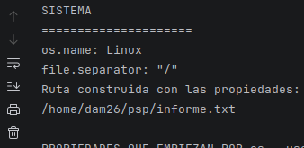

# Ejercicio 1

# Ejercicio 2
## A)

PID: 9717
PPID: 9436

El proceso padre es el PPID, porque es el numero que identifica el programa creador.

## B)

Desde el terminal

Desde el IDE

El PPID cambia porque cambia la identidad del programa creador, en al terminal el PPID es el 10271 y en el IDE el PPID es el 6442.

## C)

Inice el programa con java -Xmx128m InformeSistema

## D)

En windows esa ruta seria C:\User\dam26\psp\informe.txt

# Ejercicio 3

## a)
Programacion paralela porque una misma maquina ejecuta varias peticiones a la vez, el problema es que puede llegar a colapsar

## b)
Programacion distribuida porque para poder renderizar una pelicula tan grande no se puede hacer con un solo equipo necesita varios, el problema es la alta carga de la red al comunicarse todos los equipos entre ellos para enviarse los datos

## c)
Programacion concurrente porque varias instrucciones estan pasando a la vez, el problema es la complejidad en la asincronía y el control de errores 

## d)
Programacion distribuida porque la tarea se distribuye entre varios equipos, el problema es el riesgo del fallo en un nodo en medio del calculo 